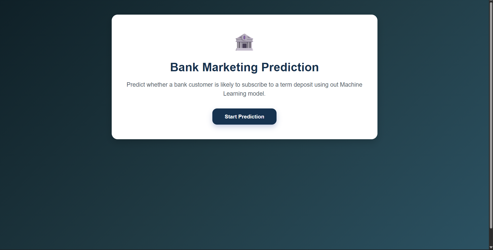
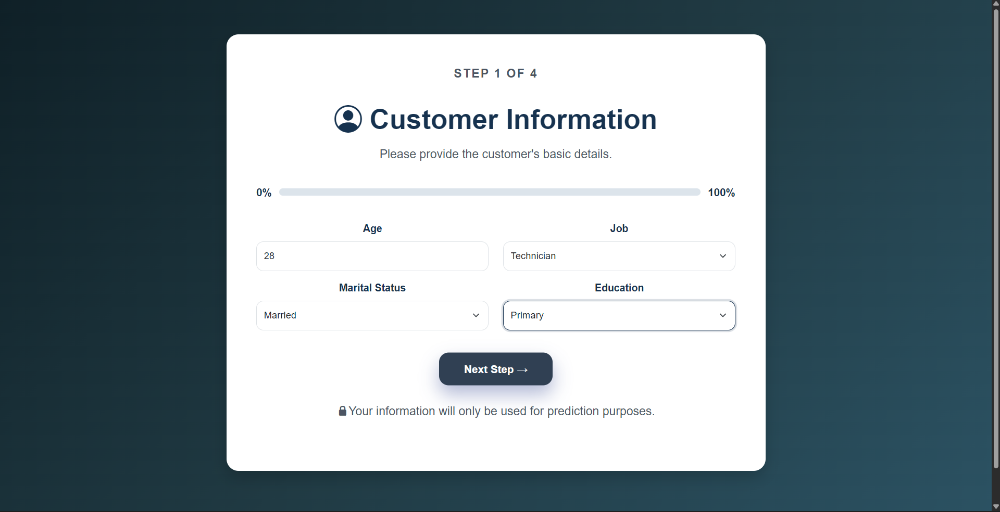
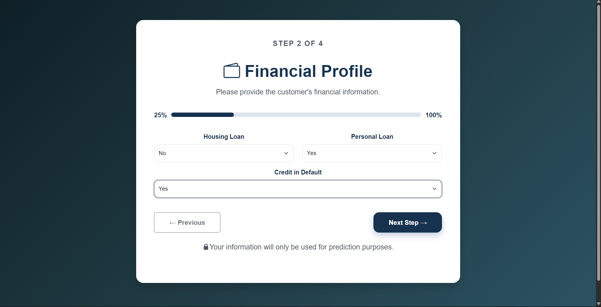
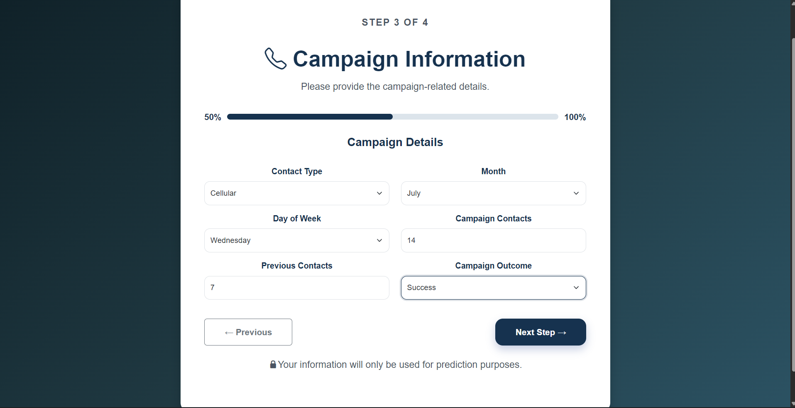
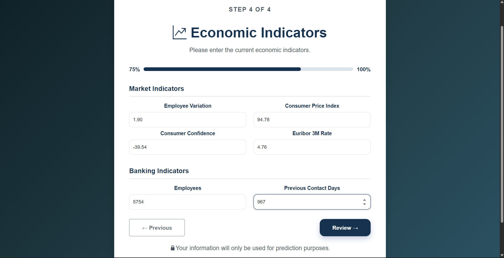
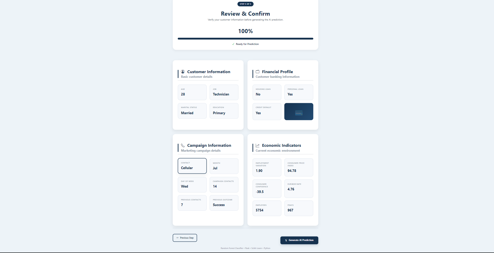
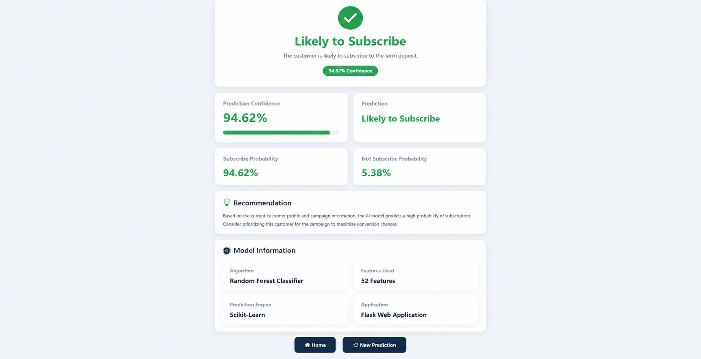
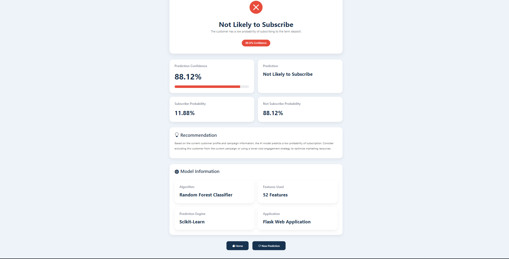

# Bank Marketing Campaign Prediction

A Machine Learning web application that predicts whether a customer is likely to subscribe to a bank term deposit based on demographic, financial, campaign, and economic information.

The application is built using **Flask**, **Scikit-learn**, and **Random Forest Classifier**, providing an intuitive multi-step interface for collecting customer information and generating predictions in real time.

---

## Project Overview

Banks invest significant resources in marketing campaigns to encourage customers to subscribe to term deposits. Predicting customer responses before launching a campaign helps banks:

- Reduce marketing costs
- Improve campaign efficiency
- Target potential customers effectively
- Increase conversion rates

This project uses a trained Random Forest model to classify whether a customer is likely to subscribe to a term deposit.

---

## Features

- Multi-step customer information form
- Real-time prediction using Machine Learning
- Prediction confidence score
- Subscription probability analysis
- Recommendation based on prediction
- Responsive Flask web interface
- Professional dashboard for prediction results

---

## Technology Stack

### Programming Language

- Python

### Machine Learning

- Scikit-learn
- Random Forest Classifier
- Pandas
- NumPy
- Joblib

### Web Development

- Flask
- HTML5
- CSS3
- Bootstrap 5
- Jinja2

---

## Project Structure

```
Bank-Marketing-Campaign-Prediction/
│
├── dataset/
├── models/
│   ├── random_forest_model.pkl
│   └── model_columns.pkl
│
├── screenshots/
│   ├── home-page.png
│   ├── customer-information.png
│   ├── financial-information.png
│   ├── campaign-information.png
│   ├── economic-indicators.png
│   ├── review-page.png
│   ├── prediction-subscribed.png
│   └── prediction-not-subscribed.png
│
├── static/
├── templates/
├── app.py
├── requirements.txt
├── README.md
└── LICENSE
```

---

# Application Screenshots

## Home Page



---

## Customer Information



---

## Financial Information



---

## Campaign Information



---

## Economic Indicators



---

## Review Page



---

## Prediction Result - Likely to Subscribe



---

## Prediction Result - Not Likely to Subscribe



---

# Project Workflow

```text
Home Page
     │
     ▼
Customer Information
     │
     ▼
Financial Information
     │
     ▼
Campaign Information
     │
     ▼
Economic Indicators
     │
     ▼
Review Page
     │
     ▼
Machine Learning Prediction
     │
     ▼
Prediction Dashboard
```

---

# Machine Learning Pipeline

```
Dataset
   │
   ▼
Data Cleaning
   │
   ▼
Feature Engineering
   │
   ▼
One-Hot Encoding
   │
   ▼
Train-Test Split
   │
   ▼
Random Forest Training
   │
   ▼
Model Evaluation
   │
   ▼
Save Model (.pkl)
   │
   ▼
Flask Deployment
```

---

# Installation

Clone the repository

```bash
git clone https://github.com/rajesh5792/Bank-Marketing-Campaign-Prediction.git
```

Move into the project directory

```bash
cd Bank-Marketing-Campaign-Prediction
```

Create a virtual environment

```bash
python -m venv venv
```

Activate the virtual environment

**Windows**

```bash
venv\Scripts\activate
```

**Linux / macOS**

```bash
source venv/bin/activate
```

Install dependencies

```bash
pip install -r requirements.txt
```

Run the application

```bash
python app.py
```

Open your browser and visit

```
http://127.0.0.1:5000
```

---

# Model Information

| Attribute | Details |
|------------|---------|
| Algorithm | Random Forest Classifier |
| Task | Binary Classification |
| Framework | Scikit-learn |
| Language | Python |
| Deployment | Flask |

---

# Future Improvements

- User authentication
- Model comparison dashboard
- Explainable AI (SHAP/LIME)
- Cloud deployment
- Database integration
- REST API support

---

# Author

**Rajesh Kannan L**

GitHub: https://github.com/rajesh5792

---

# License

This project is licensed under the MIT License.
